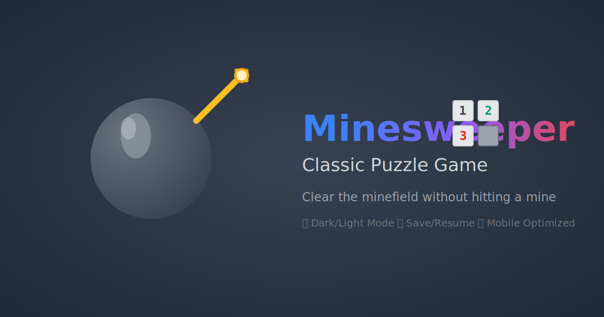

# 💣 Minesweeper Game

<div align="center">



**A beautiful, modern take on the classic Minesweeper puzzle game**

[](https://minesweeper.sugarandcoffee.co.uk)
[](https://nextjs.org/)
[](https://www.typescriptlang.org/)
[](https://tailwindcss.com/)

</div>

## ✨ Features

🎯 **Classic Gameplay** - Traditional minesweeper rules with modern UX  
🌙 **Dark/Light Mode** - Beautiful themes that adapt to your preference  
📱 **Mobile Optimized** - Responsive design that works perfectly on all devices  
💾 **Save/Resume** - Automatic game state persistence using localStorage  
🎨 **Smooth Animations** - Framer Motion powered transitions and effects  
🔥 **Modern Tech Stack** - Built with Next.js 15, TypeScript, and Tailwind CSS  
📊 **Google Analytics** - Comprehensive event tracking for insights  
🚀 **PWA Ready** - Installable as a Progressive Web App  
♿ **Accessible** - WCAG compliant with keyboard navigation support

## 🎮 How to Play

1. **Left Click** - Reveal a cell
2. **Right Click** - Flag/unflag a suspected mine
3. **Middle Click** - Chord click (reveal all adjacent cells when flags match mine count)
4. **Goal** - Reveal all non-mine cells without hitting a mine

### Game Rules

- Numbers indicate how many mines are adjacent to that cell
- Use logic and deduction to identify mine locations
- Flag suspected mines to help track your progress
- Game is won when all non-mine cells are revealed

## 🚀 Quick Start

### Prerequisites

- **Node.js** 18.0 or later
- **npm**, **yarn**, **pnpm**, or **bun**

### Installation

```bash
# Clone the repository
git clone https://github.com/yourusername/minesweeper.git
cd minesweeper

# Install dependencies
npm install

# Start the development server
npm run dev
```

Open [http://localhost:3000](http://localhost:3000) to play the game locally.

## 🛠️ Available Scripts

| Script          | Description                              |
| --------------- | ---------------------------------------- |
| `npm run dev`   | Start development server with hot reload |
| `npm run build` | Build the app for production             |
| `npm run start` | Start the production server              |
| `npm run lint`  | Run ESLint for code quality checks       |

## 🏗️ Tech Stack

### Frontend

- **[Next.js 15](https://nextjs.org/)** - React framework with App Router
- **[TypeScript](https://www.typescriptlang.org/)** - Type-safe development
- **[Tailwind CSS](https://tailwindcss.com/)** - Utility-first CSS framework
- **[Framer Motion](https://www.framer.com/motion/)** - Animation library
- **[Lucide React](https://lucide.dev/)** - Beautiful SVG icons

### Analytics & SEO

- **[@next/third-parties](https://nextjs.org/docs/app/building-your-application/optimizing/third-party-libraries)** - Google Analytics integration
- **Comprehensive metadata** - Open Graph, Twitter Cards, structured data
- **SEO optimized** - Sitemap, robots.txt, canonical URLs

### Development

- **ESLint** - Code linting and quality
- **PostCSS** - CSS processing
- **Git** - Version control

## 📁 Project Structure

```
minesweeper/
├── src/
│   ├── app/                    # Next.js app directory
│   │   ├── layout.tsx         # Root layout with metadata
│   │   ├── page.tsx           # Home page
│   │   ├── globals.css        # Global styles
│   │   └── sitemap.ts         # Dynamic sitemap generation
│   ├── components/            # React components
│   │   ├── GameBoard.tsx      # Main game board grid
│   │   ├── GameCell.tsx       # Individual cell component
│   │   ├── GameControls.tsx   # Game controls and stats
│   │   ├── GameHeader.tsx     # Header component
│   │   ├── GameModal.tsx      # Win/lose modal
│   │   ├── GameTitle.tsx      # Title and description
│   │   ├── MinesweeperGame.tsx # Main game logic wrapper
│   │   └── ThemeProvider.tsx  # Dark/light mode provider
│   └── lib/                   # Utility functions
│       ├── game-logic.ts      # Core game mechanics
│       └── utils.ts           # Helper utilities
├── public/                    # Static assets
│   ├── icon.svg              # App icon
│   ├── apple-icon.svg        # Apple touch icon
│   ├── favicon.svg           # Favicon
│   ├── og-image.svg          # Open Graph image
│   ├── manifest.json         # PWA manifest
│   └── robots.txt            # SEO robots file
└── package.json              # Dependencies and scripts
```

## 🎯 Game Logic

### Core Mechanics

- **Random mine generation** using seeded algorithms for reproducible games
- **Flood fill algorithm** for revealing connected empty cells
- **Chord clicking** for advanced gameplay
- **Win condition detection** based on revealed non-mine cells
- **Save/resume functionality** with localStorage persistence

### Key Components

- **`initializeBoard()`** - Creates game board with mines
- **`revealCell()`** - Handles cell revelation with flood fill
- **`flagCell()`** - Toggles flag state on cells
- **`checkWinCondition()`** - Determines if player has won

## 📊 Analytics Events

The game tracks user engagement through Google Analytics:

- **Game Start** - When first cell is clicked
- **Game Won/Lost** - With completion time and stats
- **Game Reset** - From different UI elements
- **Modal Interactions** - Close and new game actions

## 🎨 Theming

The game supports both light and dark themes with:

- **System preference detection** - Automatically matches OS theme
- **Manual toggle** - Theme switcher in game controls
- **Persistent preference** - Remembers user choice
- **Smooth transitions** - Animated theme changes

## 🚀 Deployment

### Vercel (Recommended)

```bash
# Build the project
npm run build

# Deploy to Vercel
npx vercel --prod
```

### Custom Domain Setup

The app is configured for `minesweeper.sugarandcoffee.co.uk`:

- Update `metadataBase` in `src/app/layout.tsx` for your domain
- Modify `robots.txt` and `sitemap.ts` with your URLs
- Configure DNS and SSL certificates

## 🤝 Contributing

Contributions are welcome! Please feel free to submit a Pull Request.

### Development Guidelines

1. **Code Style** - Follow the existing TypeScript/React patterns
2. **Components** - Keep components focused and reusable
3. **Testing** - Ensure game logic works correctly
4. **Performance** - Maintain smooth 60fps animations
5. **Accessibility** - Support keyboard navigation and screen readers

## 📝 License

This project is open source and available under the [MIT License](LICENSE).

## 🙏 Acknowledgments

- **Classic Minesweeper** - For the timeless game design
- **Next.js Team** - For the amazing React framework
- **Tailwind CSS** - For the utility-first CSS approach
- **Framer Motion** - For smooth animations
- **Lucide** - For beautiful icons

---

<div align="center">

**[🎮 Play Now](https://minesweeper.sugarandcoffee.co.uk) | [🐛 Report Bug](https://github.com/yourusername/minesweeper/issues) | [💡 Request Feature](https://github.com/yourusername/minesweeper/issues)**

Made with ❤️ and ☕

</div>
